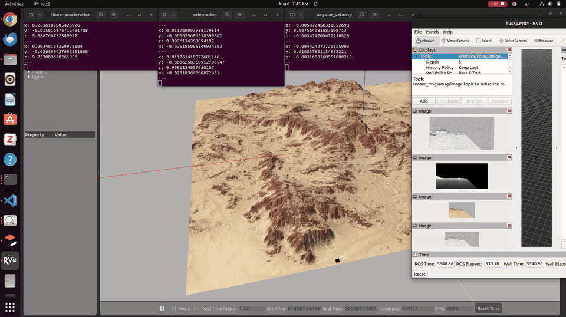
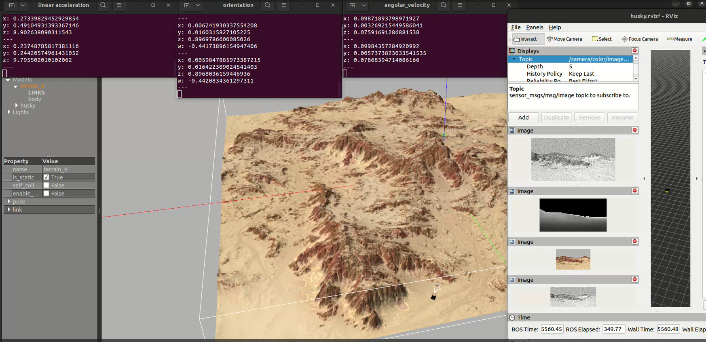

# Husky Gazebo Image Capture

ROS 2 Humble node for driving a simulated Husky robot in Gazebo and capturing image/odometry snapshots.

## Purpose

This repo provides a small public-safe ROS 2 utility for:

- keyboard driving a Husky-style mobile robot,
- subscribing to a camera image topic,
- subscribing to Husky odometry,
- saving image snapshots on demand,
- logging matching pose metadata to `poses.csv`.

The captured images may be useful as input data for later ORB-SLAM experiments in Gazebo, but those experiments are not implemented here.

## Visual Evidence

The media below shows the Gazebo/RViz workflow used around this capture utility. It documents the simulation, camera visualization, and topic inspection context; it is not a SLAM result or benchmark.

The GIF compresses the full `2 min 11 sec` recording into a `10 sec` overview.



Static view of the same workflow context:



## Relation to My Research Direction

My research direction includes mobile manipulation, active sensing, state estimation, and structure-aware scanning.

This repository supports that direction at the data-collection layer:

- mobile robot operation in simulation,
- camera image capture,
- pose/odometry logging,
- snapshot datasets for visual-state-estimation experiments,
- public supporting evidence for ROS 2 robotics workflow practice.

## What This Repository Is

- A ROS 2 Humble package.
- A Husky/Gazebo image capture utility.
- A keyboard teleoperation and snapshot node.
- A public support repo for later visual-SLAM dataset work.

## What This Repository Is Not

- It is not an ORB-SLAM implementation.
- It is not an ORB-SLAM3 wrapper.
- It is not a visual-SLAM backend.
- It is not a map-building or localization benchmark.
- It does not contain private datasets or unpublished research results.

## Implemented Now

- [x] `drive_and_snap` ROS 2 node.
- [x] Keyboard driving through `/cmd_vel`.
- [x] Camera subscription from `/camera/color/image_raw`.
- [x] Odometry subscription from `/husky_velocity_controller/odom`.
- [x] Snapshot capture using the `P` key.
- [x] PNG image saving.
- [x] Pose logging to `poses.csv`.
- [ ] ORB-SLAM execution.
- [ ] Visual-SLAM evaluation.
- [ ] Trajectory comparison.
- [ ] Dataset release.

## Node Behavior

The node:

1. publishes velocity commands to `/cmd_vel`,
2. stores the latest image from `/camera/color/image_raw`,
3. stores the latest odometry from `/husky_velocity_controller/odom`,
4. saves the current image when `P` is pressed,
5. appends the image filename and pose to `poses.csv`.

Keyboard controls:

| Key | Action |
|---|---|
| `W` | drive forward |
| `S` | drive backward |
| `A` / `Q` | rotate left |
| `D` / `E` | rotate right |
| `Space` | stop |
| `P` | save snapshot |
| `Esc` | quit |

## Output Format

Snapshots are saved as PNG images.

Pose metadata is appended to:

```text
poses.csv
```

CSV columns:

```text
timestamp,filename,x,y,z,qx,qy,qz,qw
```

By default, output is saved under:

```text
~/husky_snaps/
```

The output directory can be overridden with:

```bash
export HUSKY_SNAP_DIR=/path/to/output
```

## Current Contents

```text
src/drive_and_snap.py   ROS 2 node for Husky driving and snapshot capture
package.xml             ROS 2 package metadata
CMakeLists.txt          ROS 2 install configuration
requirements.txt        Python helper dependencies
media/                  public README visuals from Gazebo/RViz workflow
```

## Installation

Create or enter a ROS 2 Humble workspace:

```bash
mkdir -p ~/ros2_ws/src
cd ~/ros2_ws/src
git clone https://github.com/WikiGenius/husky-gazebo-image-capture.git
cd ~/ros2_ws
rosdep install --from-paths src --ignore-src -r -y
python -m pip install -r src/husky-gazebo-image-capture/requirements.txt
colcon build --packages-select husky_gazebo_image_capture
source install/setup.bash
```

## Run

Start a Husky/Gazebo simulation separately so that the required topics are available.

Expected topics:

```text
/cmd_vel
/camera/color/image_raw
/husky_velocity_controller/odom
```

Run the node:

```bash
ros2 run husky_gazebo_image_capture drive_and_snap.py
```

Press `P` while driving to save image/odometry snapshots.

## Use With ORB-SLAM Workflows

The images captured by this node can be used later in ORB-SLAM or visual-SLAM experiments.

That later workflow is outside this repository. This repo only handles Gazebo/Husky driving, image capture, and odometry logging.

## Limitations

- The repository assumes a Husky/Gazebo setup is already running.
- Topic names are currently fixed in `src/drive_and_snap.py`.
- It does not include ORB-SLAM code.
- It does not include a SLAM training or evaluation pipeline.
- It does not include released datasets.
- It does not report benchmark results.
- The included media are workflow visuals, not quantitative evaluation.

## Roadmap

- [ ] Make topic names configurable through ROS 2 parameters.
- [ ] Add launch file after the simulation setup is stable.
- [ ] Add a short dataset-folder convention.
- [ ] Add example snapshot metadata from a non-private toy run.
- [ ] Document how exported images can be prepared for visual-SLAM experiments.

## Citation / Acknowledgment

Acknowledge Husky, ROS 2, Gazebo, OpenCV, and any visual-SLAM tools used in downstream experiments.
